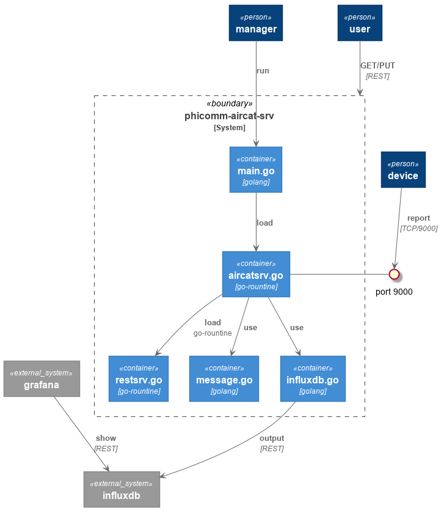

# Phicomm-aircat-srv

A Server serv at port 9000 for phicomm wukong m1 aircat, after you hijack DNS aircat.phicomm.com for your phicomm m1.

## Configuration

```json
{
    "ServerAddr": ":9000",
    "RESTServerAddr": "localhost:8080",
    "InfluxdbServer": "localhost:8086"
}
```

* *RESTServerAddr* serv at this address for changing brightness
* *InfluxdbServer* write data into influxdb(db=aircat),  
  phicomm-aircat-srv write data in console ,as if deleting this line if you dont use influxdb

## Usage

* Change brightness  
you can change brightness for (0,25,50,100)

```shell
curl -XPUT http://localhost:8080/v1/aircat  --data  "{\"brightness\":\"100\",\"type\":2}"
```

* Query current air measurement

```shell
curl http://localhost:8080/v1/aircat
```

## Compile&Run on router

You can run *phicomm-aircat-srv* in router(ex. Phicomm k2p),too.

```shell
GOOS=linux GOARCH=mipsle go build github.com/corbamico/phicomm-aircat-srv/server
```

## Reference



## Todo

* [x] Serv at 9000
* [x] REST Serv for changing brightness
* [x] Output to influxDB
* [ ] docker-compose.yaml for influxDB/grafana
* [ ] default dashboard for grafana docker
* [ ] support more than one device
